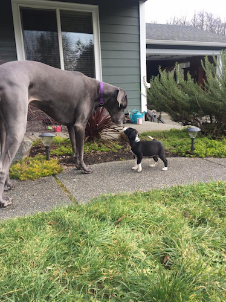
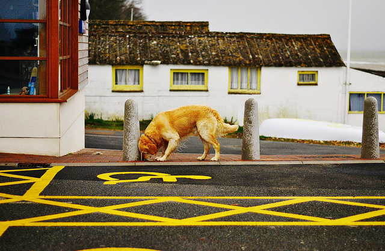

<!-- .slide: data-background="reveal.js/img/title.png" class="center" -->

# Building Responsive Web Apps with the ArcGIS API for JavaScript

Kelly Hutchins and Juan Carlos Franco

---

# Outline

* Background
* Themes
* View Breakpoints
* Widgets
* View UI
* Calcite Web

---
# So many devices



---
# Separate Apps

* Multiple versions of app
* Browser or platform sniffing



---

# Responsive Design

* Fluid grids
* Flexible elements
* Media queries


---
# Feature Detection

```javascript
 function detectWebGLContext () {
    var canvas = document.createElement("canvas");
    var gl = canvas.getContext("webgl") ||
             canvas.getContext("experimental-webgl");
    if (gl && gl instanceof WebGLRenderingContext) {
      // Supported
    }
    else {
      // Not supported
    }
  }
```

[Demo](./demos/feature-detection.html)

---

# Themes

Cool themes, bro.


`https://js.arcgis.com/<version>/themes/<theme>/main.css`

---

# Themes

* [light (default)](./demos/themes.html?theme=light)
* [light-blue](./demos/themes.html?theme=light-blue)
* [light-green](./demos/themes.html?theme=light-green)
* [light-purple](./demos/themes.html?theme=light-purple)
* [light-red](./demos/themes.html?theme=light-red)
* [dark](./demos/themes.html?theme=dark)
* [dark-blue](./demos/themes.html?theme=dark-blue)
* [dark-green](./demos/themes.html?theme=dark-green)
* [dark-purple](./demos/themes.html?theme=dark-purple)
* [dark-red](./demos/themes.html?theme=dark-red)

---

# View UI

* Takes control of component layout (widgets/nodes)
  * Less code!
* Consistent spacing
* Dynamically change layout

---

# View UI in Action

```
view.ui.add(nodeOrWidget, "top-right");

view.ui.move(nodeOrWidget, "bottom-right");

view.ui.remove(nodeOrWidget);
```

[Demo](./demos/view-ui.html)

---

# View breakpoints

Helper CSS classes when page width != view width:

```
esri-view-<dimension>-<size>
esri-view-<dimension>-less-than-<size>
esri-view-<dimension>-greater-than-<size>
```

where

* `dimension` = `width`, `height`
* `size` = `xsmall`, `small`, `medium`, `large`, `xlarge`

---

# View breakpoints

There's also `orientation`

* `esri-view-orientation-landscape`
* `esri-view-orientation-portrait`

---

# View breakpoints

For example, for medium-width, xsmall-height view:

```
// height
.esri-view-height-xsmall
.esri-view-height-less-than-small
.esri-view-height-less-than-medium
.esri-view-height-less-than-large
.esri-view-height-less-than-xlarge

// width
.esri-view-width-medium
.esri-view-width-greater-than-xsmall
.esri-view-width-greater-than-small
.esri-view-width-less-than-large
.esri-view-width-less-than-xlarge

// orientation
.esri-view-orientation-landscape
```

[Demo](./demos/view-breakpoints.html)

---

# View breakpoints

So, what's so special about these breakpoints?

They can be accessed programmatically:

```
if (view.orientation === "landscape") {
  // ...
}
```

```
if (view.widthBreakpoint === "large") {
  // ...
}
```

[Demo](./demos/view-breakpoints-programmatically.html)

---

# Widgets

* Mobile-friendly

---

# Widgets

At 4.3:

* Attribution
* BasemapGallery
* BasemapToggle
* Compass
* Expand
* Home
* Legend
* LayerList
* Locate
* Popup
* Print
* Search
* Track
* Zoom

---

# Configuring Widgets - Popup

* Adapt to screen size
* Dockable
[Demo](./demos/widget-expand.html)

---

# Configuring widgets - Expand
* Hide/Show a container

---

# Putting it all together

[Demo](./demos/main.html)

---

## Suggested Sessions

* [Designing Great UX/UI with Calcite Maps](https://devsummitps17.schedule.esri.com/session-catalog/107565610)
* [Customizing the ArcGIS API for JavaScript Widgets](https://devsummitps17.schedule.esri.com/session-catalog/937267108)
* [ArcGIS API for JavaScript: Building Mobile Web Apps](https://devsummitps17.schedule.esri.com/session-catalog/1717886282)

---

## Additional Resources

* [View UI](http://jscore.esri.com/javascript/latest/guide/view-ui/index.html)
* [Styling](http://developers.arcgis.com/javascript/latest/guide/styling/index.html)
* [Calcite Web](http://esri.github.io/calcite-web/)
* [JavaScript Sessions at DevSummit](https://devsummit.schedule.esri.com/#search/sessions/q:javascript)
* [Documentation - 4.3](https://developers.arcgis.com/javascript/latest)

---

# Questions?

---

<!-- .slide: data-background="reveal.js/img/end.png" -->
